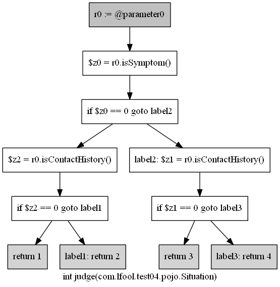

# 实验四

## The COVID-19 Problem

**[Source Code](./src/main/java/com/lfool/test04/Diagnosis.java)**

**[Test Code](./src/main/java/test/com/lfool/test04/DiagnosisTest.java)**

**[Decision Table](./src/main/resources/decisionTable.csv)**

## Decision Table Analysis

<table
  border="0"
  cellpadding="0"
  cellspacing="0"
  width="144"
  style="border-collapse: collapse; table-layout: fixed; width: 108pt;"
>
  <col width="144" span="2" style="width: 108pt;" />
  <tr height="19" style="height: 14.25pt;">
    <td
      height="19"
      class="xl65"
      width="72"
      style="height: 14.25pt; width: 54pt;"
    >
      变量
    </td>
    <td class="xl65" width="72" style="border-left: none; width: 54pt;">
      区间
    </td>
  </tr>
  <tr height="19" style="height: 14.25pt;">
    <td
      rowspan="2"
      height="38"
      class="xl65"
      style="height: 28.5pt; border-top: none;"
    >
      症状
    </td>
    <td class="xl65" style="border-top: none; border-left: none;">有</td>
  </tr>
  <tr height="19" style="height: 14.25pt;">
    <td
      height="19"
      class="xl65"
      style="height: 14.25pt; border-top: none; border-left: none;"
    >
      无
    </td>
  </tr>
  <tr height="19" style="height: 14.25pt;">
    <td
      rowspan="2"
      height="38"
      class="xl65"
      style="height: 28.5pt; border-top: none;"
    >
      接触史
    </td>
    <td class="xl65" style="border-top: none; border-left: none;">有</td>
  </tr>
  <tr height="19" style="height: 14.25pt;">
    <td
      height="19"
      class="xl65"
      style="height: 14.25pt; border-top: none; border-left: none;"
    >
      无
    </td>
  </tr>
  <![if supportMisalignedColumns]>
  <tr height="0" style="display: none;">
    <td width="72" style="width: 54pt;"></td>
    <td width="72" style="width: 54pt;"></td>
  </tr>
  <![endif]>
</table>

|          | 规则1 | 规则2 | 规则3 | 规则4 |
| :------: | :---: | :---: | :---: | :---: |
|  有症状  |   1   |   1   |   0   |   0   |
|  无症状  |   0   |   0   |   1   |   1   |
| 有接触史 |   1   |   0   |   1   |   0   |
| 无接触史 |   0   |   1   |   0   |   1   |
|    1     |   T   |       |       |       |
|    2     |       |   T   |       |       |
|    3     |       |       |   T   |       |
|    4     |       |       |       |   T   |

## Control Flow Graph

